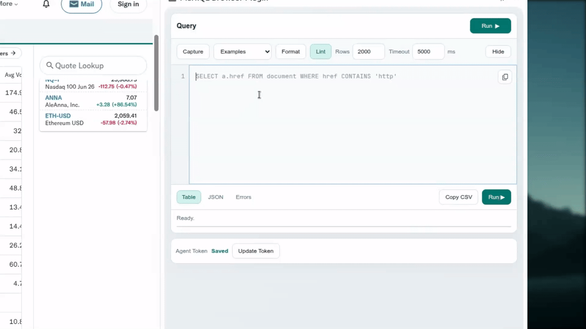

<p align="center">
  <picture>
    <source media="(prefers-color-scheme: dark)" srcset="docs/assets/logo/markql_logo_dark.svg">
    <source media="(prefers-color-scheme: light)" srcset="docs/assets/logo/markql_logo_light.svg">
    
  </picture>
</p>

<h1 align="center">MarkQL</h1>
<p align="center">SQL-style query engine for HTML</p>

<p align="center">
  <a href="https://github.com/darhnoel/markql/actions/workflows/python-wheels.yml"></a>
  
  <a href="https://github.com/darhnoel/markql/tags"></a>
  <a href="https://pypi.org/project/pyxsql/"></a>
  <a href="https://pypi.org/project/pyxsql/"></a>
  <a href="LICENSE"></a>
</p>

MarkQL is a **SQL-style query engine for HTML** that lets you **select precisely what you need**, **filter to the relevant parts of a page**, and **extract structured fields** using the familiar `SELECT ... FROM ... WHERE ...` flow, rather than relying on brittle, ad-hoc scraping logic.

## Demo

<p align="center">
  
</p>

## Quick Start

Prerequisites:
- CMake 3.16+
- A C++20 compiler
- Boost (multiprecision); set `-DMARKQL_ENABLE_KHMER_NUMBER=OFF` to skip Boost
- Optional dependencies: `libxml2`, `curl`, `nlohmann_json`, `arrow/parquet`

Ubuntu/Debian/WSL (minimal packages):

```bash
sudo apt update
sudo apt install -y \
  git ca-certificates pkg-config \
  build-essential cmake ninja-build \
  libboost-dev
```

Optional feature packages:

```bash
sudo apt install -y libxml2-dev libcurl4-openssl-dev nlohmann-json3-dev
```

Arrow/Parquet packages (often missing on older distros):

```bash
sudo apt install -y libarrow-dev libparquet-dev
```

macOS (Homebrew):

```bash
xcode-select --install
brew install cmake ninja pkg-config boost
```

Optional feature packages:

```bash
brew install libxml2 curl nlohmann-json
```

Arrow/Parquet:

```bash
brew install apache-arrow
```

Build (project default):

```bash
./scripts/build/build.sh
```

Minimal build when optional dependencies are unavailable:

```bash
cmake -S . -B build \
  -DMARKQL_WITH_LIBXML2=OFF \
  -DMARKQL_WITH_CURL=OFF \
  -DMARKQL_WITH_ARROW=OFF \
  -DMARKQL_WITH_NLOHMANN_JSON=OFF \
  -DMARKQL_BUILD_AGENT=ON \
  -DMARKQL_AGENT_FETCH_DEPS=ON
cmake --build build
```

To build without Boost, add `-DMARKQL_ENABLE_KHMER_NUMBER=OFF`.

Run one query:

```bash
./build/markql --query "SELECT div FROM doc LIMIT 5;" --input ./data/index.html
```

Run interactive REPL:

```bash
./build/markql --interactive --input ./data/index.html
```

## Browser Plugin MVP

Build and run `markql-agent` (localhost `127.0.0.1:7337`):

```bash
./scripts/build/build.sh
./scripts/agent/start-agent.sh
```

Notes:
- `MARKQL_AGENT_TOKEN` is the primary agent token variable.
- `scripts/agent/start-agent.sh` sets a default token if not provided.
- A legacy agent token variable still works during the migration window.
- You can set your own token:

```bash
MARKQL_AGENT_TOKEN=your-secret-token ./scripts/agent/start-agent.sh
```

Load the Chrome extension:
1. Open `chrome://extensions`
2. Enable `Developer mode`
3. Click `Load unpacked`
4. Select `browser_plugin/extension`

Extension host permission:
- `http://127.0.0.1:7337/*`

## CLI Notes

- Primary CLI binary is `./build/markql`.
- Legacy compatibility binary `./build/markql` is still generated.
- `doc` and `document` are both valid sources in `FROM`.
- If `--input` is omitted, the CLI reads HTML from `stdin`.
- URL sources (`FROM 'https://...'`) require `MARKQL_WITH_CURL=ON`.
- `TO PARQUET(...)` requires `MARKQL_WITH_ARROW=ON`.
- `INNER_HTML(...)` returns minified HTML by default. Use `RAW_INNER_HTML(...)` for unmodified raw output.
- `TO TABLE(...)` supports explicit trimming/sparse options: `TRIM_EMPTY_ROWS`, `TRIM_EMPTY_COLS`, `EMPTY_IS`, `STOP_AFTER_EMPTY_ROWS`, `FORMAT`, `SPARSE_SHAPE`, and `HEADER_NORMALIZE`.

## Testing

C++ tests:

```bash
cmake --build build --target markql_tests
ctest --test-dir build --output-on-failure
```

Python package/tests (optional):

```bash
./scripts/python/install.sh
./scripts/python/test.sh
```

Browser plugin UI tests (optional):

```bash
npm install
npx playwright install chromium
npm run test:browser-plugin
```

## Documentation

- Book (chapter path + verified examples): [docs/book/SUMMARY.md](docs/book/SUMMARY.md)
- Canonical tutorial: [docs/markql-tutorial.md](docs/markql-tutorial.md)
- CLI guide: [docs/markql-cli-guide.md](docs/markql-cli-guide.md)
- Editor support plan: [docs/editor-support-plan.md](docs/editor-support-plan.md)
- VS Code extension: [docs/vscode-extension.md](docs/vscode-extension.md)
- Vim plugin: [docs/vim-plugin.md](docs/vim-plugin.md)
- Docs index: [docs/README.md](docs/README.md)
- Script layout: [scripts/README.md](scripts/README.md)
- Changelog: [CHANGELOG.md](CHANGELOG.md)

## License

Apache License 2.0. See [LICENSE](LICENSE).
